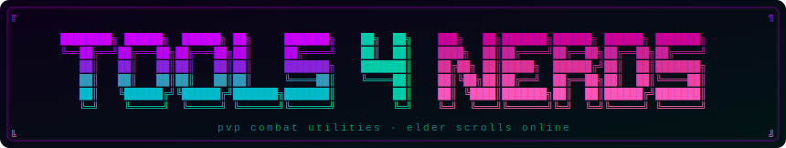

<div align="center">
  
</div>

A PvP-focused Elder Scrolls Online addon that surfaces combat information you'd otherwise have to guess at — CC immunity windows, blocked attacks, critical hits, debuff count, Mara's Balm cooldown, queue pop-ups, and global cooldown tracking.

## Features

### CC Immunity Tracker
Displays a countdown when your target is immune to crowd control, so you know exactly when it's safe to land your next CC. Works via buff detection in duels and open world, and via combat event inference in Battlegrounds and Cyrodiil.

### Block Indicator
Briefly shows a "Blocking" label when your attack is blocked, giving you immediate feedback to adjust your rotation.

### Crit Hit Marker
Plays an animated overlay on your screen when you land a critical hit. Size and color are configurable.

### Debuff Counter
Displays a live count of negative effects currently active on you. When the count reaches 6 or more, the counter flashes rapidly as a warning. The counter is draggable — click and drag it anywhere on screen. Font size and color are configurable independently of the other indicators.

### Mara's Balm Tracker
Automatically appears when 5 or more pieces of the Mara's Balm set are equipped (including backbar weapons) and hides when the set is removed. Displays **MARAS** in green when ready. When on cooldown, shows **MARAS 24s** (counting down) in red until it's ready again. Draggable — click and drag to reposition. Font size is configurable.

### Auto Queue Accept
Automatically accepts dungeon and PvP queue pop-ups so you never miss a ready check.

### Global Cooldown (GCD) Overlay
Adds a cooldown animation directly over each action bar slot during the global cooldown, giving you a clear visual indicator of when your next ability is available. Replaces the standalone "Show Global Cooldown" addon if you were using it.

- **Animation style** — Ascending (bottom to top), Descending (top to bottom), or Radial
- **Icon desaturation** — greys out ability icons during the GCD
- **Ready animation** — flashes the slot when the GCD expires
- **Potion cooldown** — optionally extends the overlay to consumable slots (off by default)

## Installation

1. Download and extract the `Tools4Nerds` folder into:
   ```
   Documents/Elder Scrolls Online/live/AddOns/
   ```
2. Ensure [LibAddonMenu-2.0](https://www.esoui.com/downloads/info7-LibAddonMenu.html) is also installed — it is required.
3. Launch ESO and enable **Tools 4 Nerds** in the AddOns menu.

## Usage

### Settings Panel
Open **Settings → AddOns → Tools 4 Nerds** to configure each feature:

| Setting | Description |
|---------|-------------|
| Account-Wide Sync | Share one settings profile across all characters |
| Text Size | Font size for CC and block indicator text |
| Enable CC Immunity Tracking | Toggle the CC countdown |
| CC Immunity Color | Color of the CC countdown text |
| Enable Block Tracking | Toggle the block indicator |
| Block Color | Color of the block indicator text |
| Enable Crit Hit Marker | Toggle the crit overlay |
| Marker Size | Size of the crit marker in pixels |
| Marker Color | Color tint of the crit marker (white = no tint) |
| Enable Debuff Counter | Toggle the debuff counter |
| Debuff Counter Color | Color of the debuff counter text |
| Counter Size | Font size of the debuff counter |
| Reset Position | Snap the debuff counter back to its default position |
| Enable Mara's Balm Tracker | Toggle the MARAS ready/cooldown indicator |
| Mara's Balm Text Size | Font size of the MARAS indicator |
| Mara's Balm Reset Position | Snap the MARAS indicator back to its default position |
| Auto Accept Queue | Toggle automatic queue acceptance |
| Enable GCD Overlay | Toggle the global cooldown animation on action bar slots |
| GCD Animation Style | Ascending, Descending, or Radial cooldown animation |
| Desaturate Icons | Grey out ability icons during the GCD |
| Ready Animation | Flash the slot when the GCD expires |
| Show Potion Cooldown | Extend the GCD overlay to consumable slots |

Each feature section has a **Test** button to preview how that indicator looks without needing to be in combat. The Mara's Balm test runs a 5-second countdown so you can see the full red → green transition, and remains visible even with the settings panel open.

### Keybinding
Assign a key to **Toggle Tools 4 Nerds** under **Settings → Controls → AddOns** to enable/disable the addon on the fly.

### Slash Commands
| Command | Description |
|---------|-------------|
| `/t4n debug` | Prints current state to chat — combat flag, target type, buff count, CC tracking status, and tick state. Useful for diagnosing why an indicator isn't showing. |
| `/t4n debugplayer` | Logs all effect changes on the player for 60 seconds. Useful for identifying buff/debuff names and durations. |
| `/t4n debugcombat` | Logs all combat events involving the player for 60 seconds. Useful for identifying ability IDs for set procs. |
| `/t4n debugfx` | Logs the next 15 effect changes on any unit. |
| `/t4n debugsets` | Prints all equipped set IDs, names, and piece counts. Useful for diagnosing set detection issues. |

## Notes

- The CC immunity tracker only activates when you are in combat and have a player targeted.
- In Battlegrounds and Cyrodiil, CC immunity is tracked via combat events (when you land a CC on your target) rather than buff reading, which may not be available in all PvP contexts.
- The nameplate immunity dot uses the same combat-event inference and will appear on enemy nameplates during their CC immunity window.
