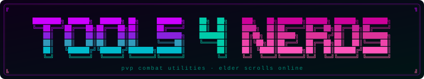

<div align="center">
  
</div>

An Elder Scrolls Online addon that surfaces combat information you'd otherwise have to guess at — CC immunity windows, blocked attacks, critical hits, set trackers, queue pop-ups, global cooldown tracking, criminal ability blocking, and DK ultimate alerts.

## Features

### CC Immunity Tracker [PvP]
Displays a countdown when your target is immune to crowd control, so you know exactly when it's safe to land your next CC. Works via buff detection in duels and open world, and via combat event inference in Battlegrounds and Cyrodiil.

### Block Indicator [PvP]
Briefly shows a "Blocking" label when your attack is blocked, giving you immediate feedback to adjust your rotation.

### Crit Hit Marker [PvP/PvE]
Plays an animated overlay on your screen when you land a critical hit. Size and color are configurable.

### Debuff Counter [PvP]
Shows a live count of negative effects currently on your character. Flashes when the count reaches 6 or more. The counter is a draggable widget — position it anywhere on screen.

### Mara's Balm Tracker [PvP]
Tracks the cooldown on Mara's Balm. Only visible when the set is equipped (5-piece detection). Shows **MARAS** in green when the proc is available and **MARAS Xs** in red during the cooldown. Draggable widget with saved position.

### Gorethief Stack Tracker [PvP]
Tracks your Gorethief stack count. Appears automatically when stacks are active and hides at zero. Shows the count in red while building (**THIEF x7**) and switches to green when you hit the 10-stack maximum. Draggable widget with saved position.

### DK Corrosive Armor Alert [PvP]
Shows a large on-screen alert when you take damage from a Dragonknight's **Corrosive Armor** or **Onslaught** ultimate. Corrosive Armor reflects your own damage back at you — this alert gives you instant feedback to stop attacking before wasting resources.

- Tracks **multiple simultaneous sources** — if two DKs have Corrosive Armor active, the alert shows **CORROSIVE ARMOR x2**
- Corrosive alert stays visible for 3 seconds after the last incoming tick
- Onslaught alert stays visible for 8 seconds
- Optional sound on detection
- Fully positionable — adjust X/Y offset, width, height, and scale in settings
- Test button in settings to preview the alert window

### Auto Queue Accept [PvP/PvE]
Automatically accepts dungeon and PvP queue pop-ups so you never miss a ready check.

### Global Cooldown (GCD) Overlay [PvP/PvE]
Adds a cooldown animation directly over each action bar slot during the global cooldown, giving you a clear visual indicator of when your next ability is available.

- **Animation style** — Ascending (bottom to top), Descending (top to bottom), or Radial
- **Icon desaturation** — greys out ability icons during the GCD
- **Ready animation** — flashes the slot when the GCD expires
- **Potion cooldown** — optionally extends the overlay to consumable slots (off by default)

### Guard Protection [PvE/Overland]
Hard-blocks criminal abilities from firing while you are in a town or city, preventing accidental bounties and guard aggro. When you press a blocked ability's keybind, it plays the ability-failed sound and does nothing. A single toggle covers all criminal ability types — no per-class or per-ability configuration needed.

Blocked abilities:
- **Necromancer** — Skeletal Mage/Archer/Arcanist, Blastbones/Stalking/Viscous, Grave Grasp/Ghostly Embrace/Empowering Grasp, Bone Golem/Pummeling/Ravenous, Frozen/Glacial/Pestilent Colossus
- **Werewolf** — Werewolf Transformation, Werewolf Berserker, Pack Leader
- **Vampire** — Blood Scion, Perfect Blood Scion

## Installation

1. Download and extract the `Tools4Nerds` folder into:
   ```
   Documents/Elder Scrolls Online/live/AddOns/
   ```
2. Ensure [LibAddonMenu-2.0](https://www.esoui.com/downloads/info7-LibAddonMenu.html) is also installed — it is required.
3. Launch ESO and enable **Tools 4 Nerds** in the AddOns menu.

## Usage

### Settings Panel
Open **Settings → AddOns → Tools 4 Nerds** to configure each feature:

| Setting | Description |
|---------|-------------|
| Account-Wide Sync | Share one settings profile across all characters |
| Text Size | Font size for CC and block indicator text |
| Enable CC Immunity Tracking | Toggle the CC countdown |
| CC Immunity Color | Color of the CC countdown text |
| Enable Block Tracking | Toggle the block indicator |
| Block Color | Color of the block indicator text |
| Enable Crit Hit Marker | Toggle the crit overlay |
| Marker Size | Size of the crit marker in pixels |
| Marker Color | Color tint of the crit marker (white = no tint) |
| Enable GCD Overlay | Toggle the global cooldown animation on action bar slots |
| GCD Animation Style | Ascending, Descending, or Radial cooldown animation |
| Desaturate Icons | Grey out ability icons during the GCD |
| Ready Animation | Flash the slot when the GCD expires |
| Show Potion Cooldown | Extend the GCD overlay to consumable slots |
| Enable Guard Protection | Block all criminal abilities in towns (Necromancer, Werewolf, Vampire) |
| Enable Debuff Counter | Toggle the live negative-effect counter |
| Debuff Counter Color | Color of the debuff counter text |
| Counter Size | Font size of the debuff counter |
| Enable Mara's Balm Tracker | Toggle the Mara's Balm cooldown display (requires set equipped) |
| Text Size (Mara's) | Font size for the Mara's Balm tracker |
| Enable Gorethief Stack Tracker | Toggle the Gorethief stack counter (appears when stacks are active) |
| Text Size (Gorethief) | Font size for the Gorethief stack counter |
| Enable Corrosive Armor Alert | Toggle the DK Corrosive Armor / Onslaught alert overlay |
| Play Sound (Corrosive) | Play a sound when Corrosive Armor or Onslaught hits you |
| Horizontal / Vertical Position | Move the alert window left/right or up/down from center |
| Alert Width / Height | Size of the alert window in pixels |
| Alert Scale | Scale the entire alert window |
| Auto Accept Queue | Toggle automatic queue acceptance |
| Enable GCD Overlay | Toggle the global cooldown animation on action bar slots |

### Keybinding
Assign a key to **Toggle Tools 4 Nerds** under **Settings → Controls → AddOns** to enable/disable the addon on the fly.

### Slash Commands
| Command | Description |
|---------|-------------|
| `/t4n debug` | Print current combat state, CC tracking, debuff count, Mara's and Gorethief status |
| `/t4n debugplayer` | Log all effect changes on your character for 60 seconds (useful for identifying buff/debuff IDs) |
| `/t4n debugsets` | Print every equipped item set with name, set ID, and piece count |
| `/t4n debugcombat` | Log all combat events involving your character for 60 seconds |
| `/t4n debugfx` | Log the next 15 `EVENT_EFFECT_CHANGED` events on any unit |
| `/t4n debugnameplates` | Inspect the nameplate control tree of the nearest unit (dev/diagnostic) |

## Notes

- The CC immunity tracker only activates when you are in combat and have a player targeted.
- In Battlegrounds and Cyrodiil, CC immunity is tracked via combat events (when you land a CC on your target) rather than buff reading, which may not be available in all PvP contexts.
- The nameplate immunity dot uses the same combat-event inference and will appear on enemy nameplates during their CC immunity window.
- Guard protection detects towns and cities by checking whether your current sub-location name differs from the zone map name, with an explicit exclusion list for all trials and arenas so it never misfires inside group content.
- The Debuff Counter and set trackers (Mara's, Gorethief) are only visible on the HUD and HUD UI scenes — they hide automatically in menus and loading screens.
- The Gorethief tracker and Mara's tracker widgets are draggable. Use the **Reset Position** buttons in settings to restore their default positions.
- The DK Corrosive Armor alert window is positioned via sliders in settings. Use the **Test Alert** button to preview it and the **Reset Layout** button to restore defaults.
